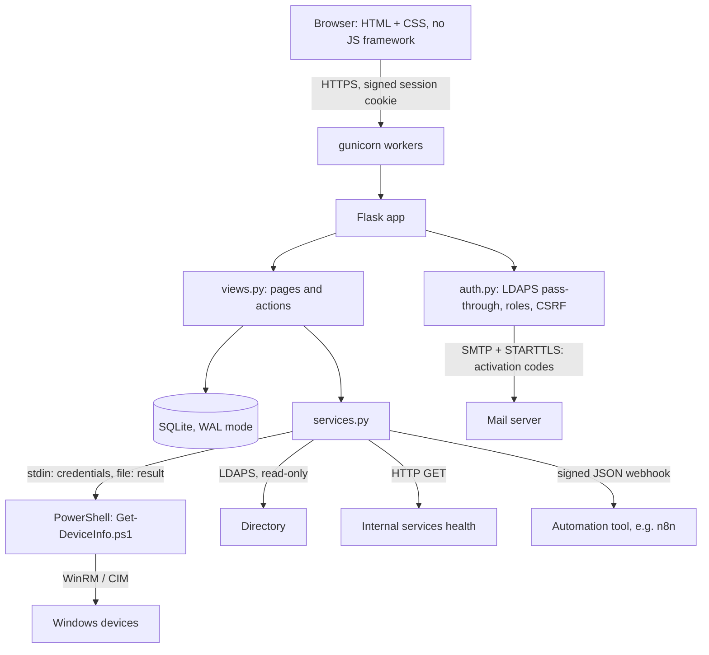
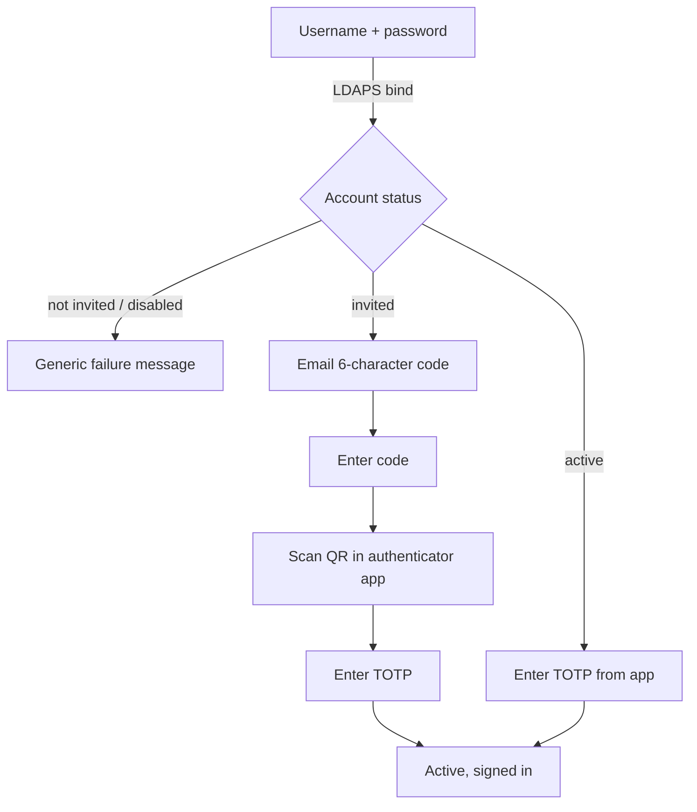

# Architecture

## Layers

| Layer | Files | Responsibility |
|---|---|---|
| Presentation | `app/templates/`, `app/static/style.css` | Server-rendered pages, light and dark mode, works on a phone. |
| Web | `app/views.py` | One route per page and per action. Every state change calls `db.audit()`. |
| Access control | `app/auth.py`, `app/mfa.py` | Invite-only sign-in, activation codes, TOTP, section permissions per role, CSRF tokens. |
| Data | `app/db.py` | Schema, plain SQL helpers, CLI commands (`init-db`, `bootstrap-admin`, `seed-demo`). |
| Integrations | `app/services.py`, `scripts/Get-DeviceInfo.ps1` | Remote device queries, directory discovery, warranty lookup, health checks, webhooks. |
| Demo | `app/demo_data.py` | Fictional people, devices, rooms, visitors, shifts and services. |

## Data model

| Table | Holds |
|---|---|
| `users`, `role_sections` | Who can sign in, their role and status (invited, active, disabled), TOTP secret, and which sections each role can open. |
| `one_time_codes`, `outbox` | Hashed activation codes with expiry and attempts; demo email outbox. |
| `assets`, `warranties`, `software` | Devices, warranty end dates, installed applications. |
| `people`, `desks`, `rooms` | Directory, floor layout, meeting rooms. |
| `checklist_runs` | Each room check with per-item results (JSON). |
| `lifecycle` | Joiner and leaver checklists with task status (JSON). |
| `visitors`, `shifts` | Visits with sign-in/out times; shifts and on-call. |
| `endpoints` | Monitored services with severity and last result. |
| `audit_log` | Every action: when, who, what, details. |

## Sign-in flow

Between the password and the second factor the session only holds a "pending" user for 10 minutes and 5 attempts; no page is accessible until both factors pass. Once both factors pass, the pending data is cleared and a new session with a new CSRF token starts.

## Request flow: a remote query

1. An engineer clicks **software** next to a device on the Assets page (POST with CSRF token).
2. `views.asset_query` checks the role, then calls `services.query_device`.
3. The hostname is validated against a strict pattern; PowerShell starts with the hostname and query type as arguments and the credentials on stdin.
4. The script opens a CIM session / WinRM connection, reads the data and writes JSON to a temporary file.
5. The app reads the file, deletes it, stores the result in SQLite, writes an audit entry and shows a message.

## Why this shape

- **No state in process memory.** gunicorn runs several workers; anything kept in a Python global would differ between them. Sessions are signed cookies and everything else is in SQLite (WAL mode lets reads continue while one worker writes).
- **Server-rendered HTML.** A handful of forms and tables do not need a frontend framework, and there is no build step to maintain.
- **Integrations behind small functions.** Each external system is one function with a demo implementation, so the app is testable without a network and each integration can be replaced on its own.

More detail on specific choices is in [docs/decisions.md](docs/decisions.md).
